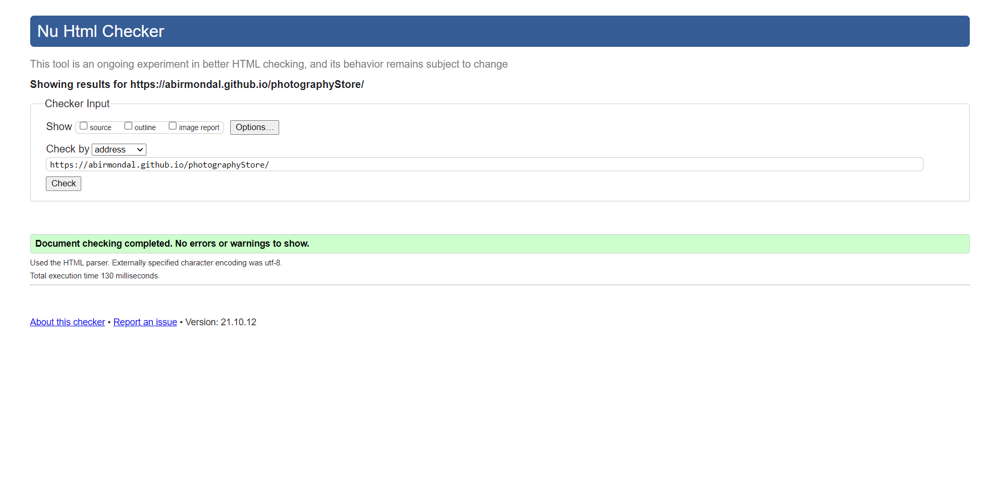
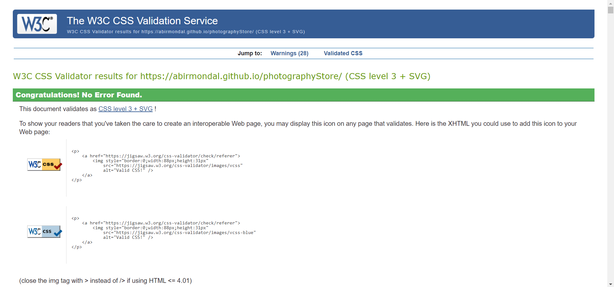
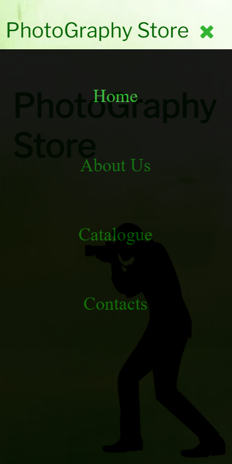
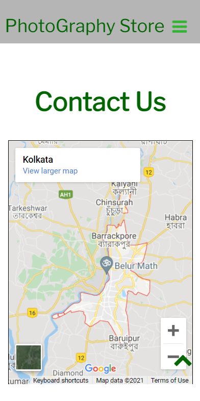
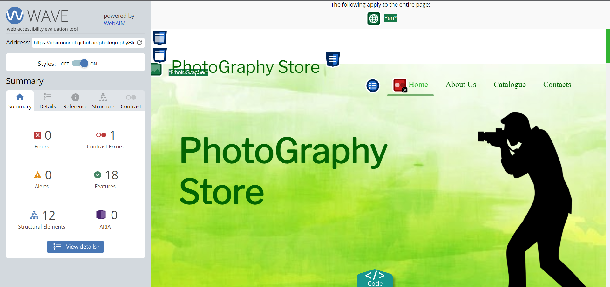

# Photography Store Portfolio

### Final Course Project, Portfolio Website for Coursera Course - Web Development for Everybody Capstone
 

> :heavy_check_mark: I did build this portfolio website from ***scratch***, and it is done using ***modile-first*** technique.
 

# Demo Sketches

### Large Screen View

### Mobile View

# Validation Reports

### Validation report from https://validator.w3.org/.

### W3C CSS Validation Report from https://jigsaw.w3.org/css-validator/.

# Responsiveness

### Desktop View

### Mobile View

# Enhancements

## Carousal Effect
The carousal effect *does not start automatically*, one has to start it manually. It is there in the **About Us** section of the webpage. Click next or previous button to start the carousal.

## Plugins Incorporated
I added a Google Map plugin. I made the iframe responsive so, it changes it's shape with screen resize.
 

## Sticky Footer
I actually did not make the full footer sticky but you can see a sticky button that is a part of the footer. It is the scroll to top button.

## Accessibility of the Page
I tried to make the page most accessible as possible. Below is the report from <a href="https://wave.webaim.org/">Wave</a>. There you can see an **contrast error**. I think it is because of the Google Map iframe.
 

## Custom JavaScript
I created a pre-loader with JS and CSS. This will show before showing the content of the page.
 
